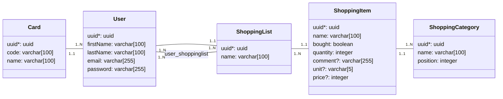

# Base de données

## MCD


Le diagramme ci-dessous sera modifié au fur et à mesure de l'évolution du MCD.



## Connexion

Pour se connecter au client PostgreSQL, utilisez la commande :

```bash
make dbshell
```

## Migrations

Lorsque vous effectuez des modifications sur les entités doctrine ainsi que sur les fichiers de mapping, vous devez générer une migration pour qu'elle soit versionnée.

Pour générer une migration, utilisez la commande :

```bash
make dbmigration
```

Une fois la migration générée, il faut l'executer. Pour ce faire il existe la commande suivante qui va prendre l'ensemble des migrations non jouées et les executer une à une.

```bash
make dbmigrate
```
